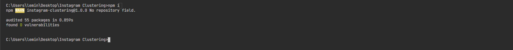
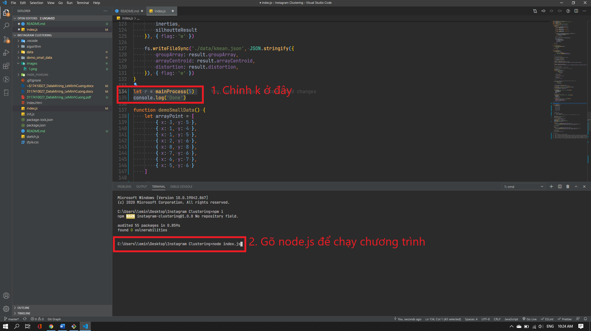
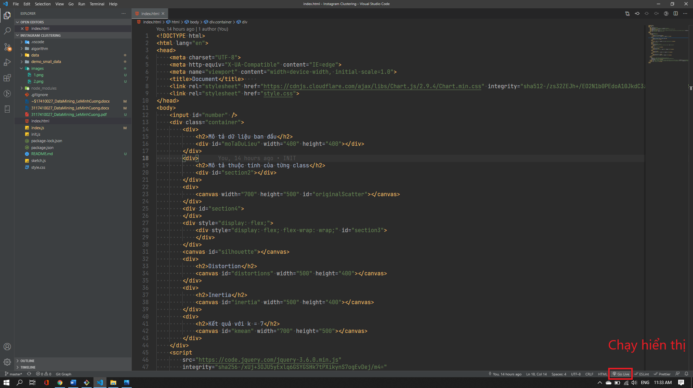
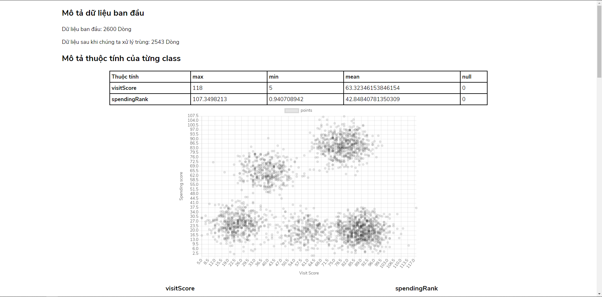
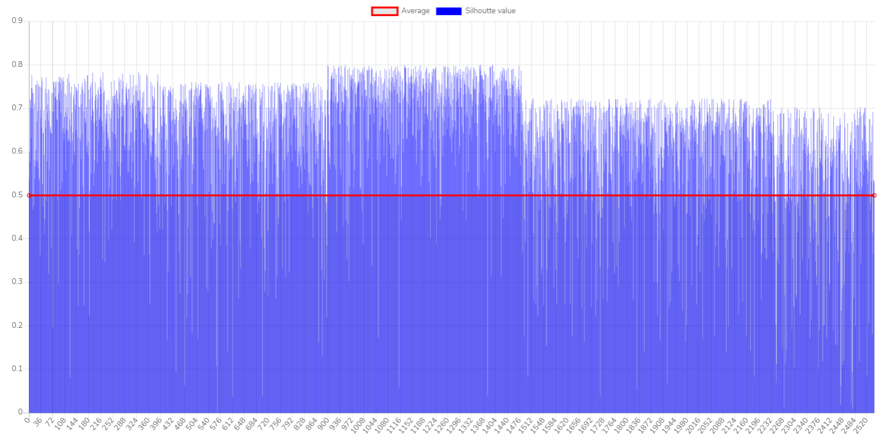
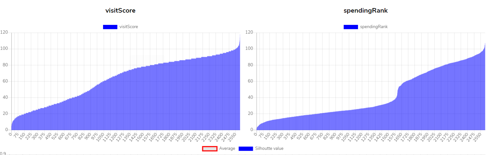
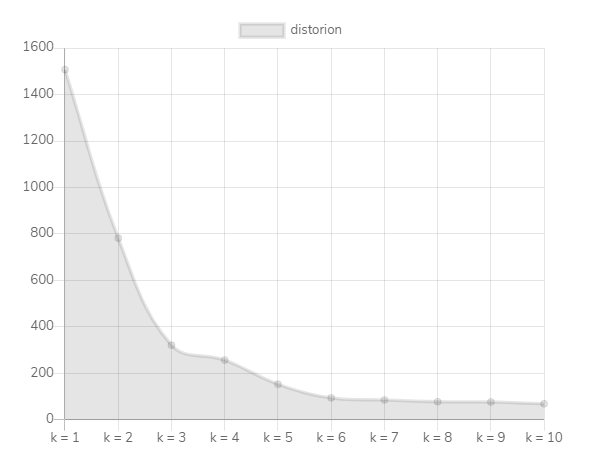
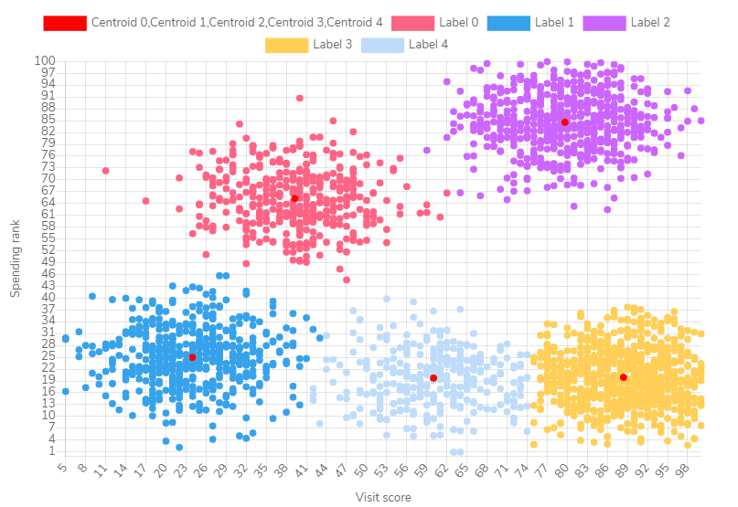

[Link Source](https://github.com/Ram4GB/Kmean_Instagram)

# Thuật toán Kmean vào ứng dụng phân cụm người dùng trên Instagram bằng Javascript

## Dữ liệu

[Nguồn](https://www.kaggle.com/chaandsheikh/instagram-visit-clustering)

## Cách chạy:

### Yêu cầu:
- Nodejs 10.x hoặc cao hơn [Cài đặt Nodejs](https://nodejs.org/en/)

### Bước 1:

Sau khi cài xong nodejs. Ta gõ lệnh terminal tại folder root <b>npm i</b>

### Bước 2:

Nếu có chỉnh sửa k thì mở file index.js ở folder root để chỉnh sửa k. Ở mainProcess function, xong rồi chúng ta gõ lệnh "node index.js". Kết quả sẽ được xuất ra ở folder data

### Bước 2:

Mở file index.html và bật live server trong vscode để hiển thị kết quả.

Nếu chưa cài: [Cài đặt](https://marketplace.visualstudio.com/items?itemName=ritwickdey.LiveServer) 

### Kết quả:

**Dữ liệu ban đầu lúc chưa phân cụm**

**Silhoutte tất cả giá trị**

**Giá trị từng thuộc tính**

**Distortion và Inertia**

**Kết quả sau khi phân cụm**

### Chú thích
- sketch dùng để vẽ chart
- folder data dùng để chứa tất cả dữ liệu sau khi chạy xong kmean ở file index.js và có dữ liệu ban đầu file csv.
- folder algorithm là folder viết thuật toán kmean (index.js). Có file utils.js bao gồm những hàm hỗ trợ tính khoảng cách và chuyển kiểu dữ liệu.

Cảm ơn thầy Lê Minh Nhựt Triều đã hướng dẫn và chỉ bảo để giúp em có được bài báo cáo tốt hơn.

### Lê Minh Cường - SGU (2021)
